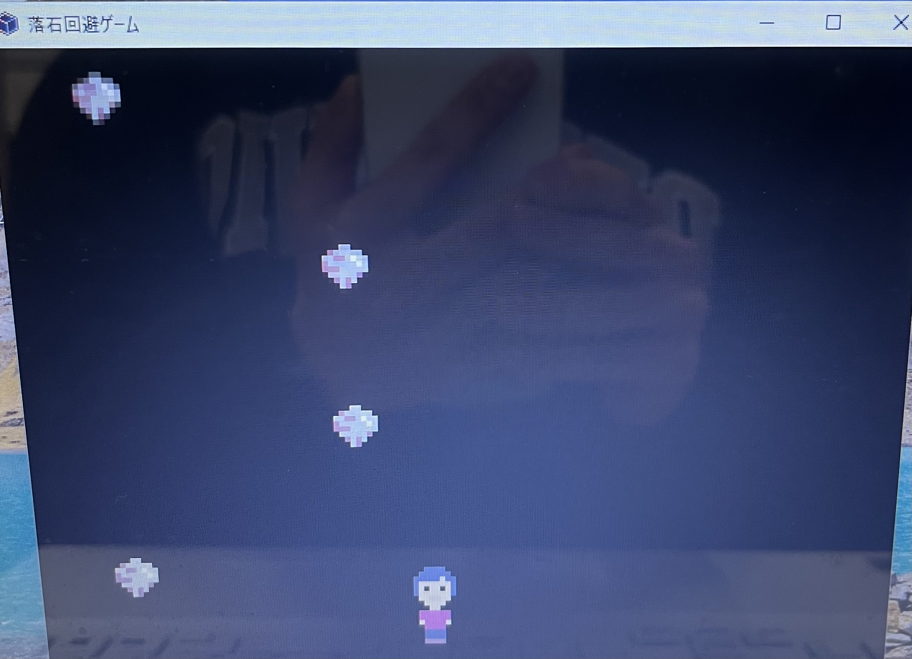

# 落石回避ゲームアプリ(Stone Dodge Game)



## 概要
Pyxelを使用して作成したシンプルな **落石回避ゲーム** です。  

上から落ちてくる石を左右に移動して避け続け、スコアを伸ばすゲームです。

時間が経つにつれて石の落下速度が速くなり、難易度が上がります。

## 操作方法

| 操作 | 内容 |
|---|---|
| マウスクリック | ゲームスタート |
| ← → キー | プレイヤー移動 |
| Shift + ← → | 高速移動 |
| ESC | ゲーム終了 |

## ルール
- 上から石が落ちてきます
- プレイヤーは左右に移動して石を避けます
- 石に当たると **ゲームオーバー**
- 生き残るほど **スコアが増加**
- スコアが増えると **石の落下速度が上昇** します

## 使用技術

- Python
- Pyxel

## 実行方法

### 1. Pyxelをインストール

```bash
pip install pyxel